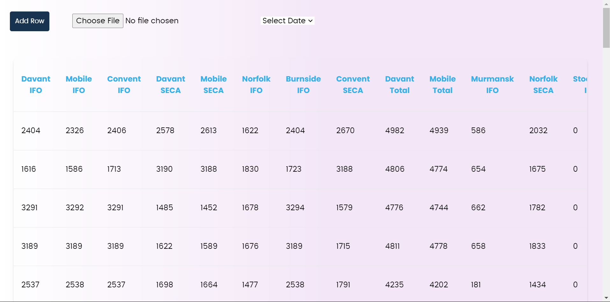

# Converting Spreadsheet into a CRUD Application

This project was bootstrapped with [Create React App](https://github.com/facebook/create-react-app).

## Tech stack
- Reactjs library for frontend
- Backend server: Express (Nodejs)
- Database: mysql (with workbench interface)
- ORM used: Sequelize

## Refernces
- Please visit official docs of Sequelize: `https://sequelize.org/docs/v6/getting-started/`

## Features
- MVC architecture
- Add, Edit delete columns and rows on the sheet
- Upload Feature

## Snaps of the Project
- Landing page

- Sheets

## Local Setup
- clone the repository and cd into the project
- cd Backend
- `npm start` or `node server.js` or `nodemon server.js` to start the backend server and to establish db connection
- also cd into frontend (a parallel bash or terminal would be better)
- run `npm start`

